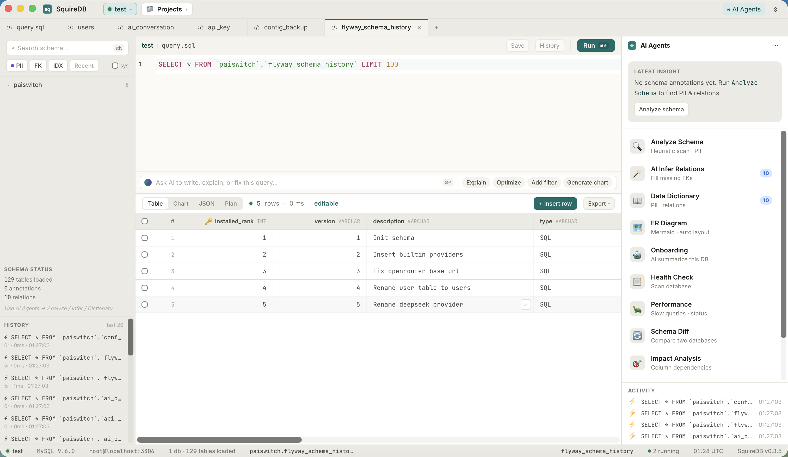

# SquireDB

> A blazing-fast, AI-native, local-first MySQL client written in Rust.

50MB 内存、本地优先、AI 改造整个工作流 —— 不只是加个聊天框。

[Features](#features) · [Why SquireDB](#why-squiredb) · [Getting started](#getting-started) · [License](#license)



---

## Why SquireDB

SquireDB 围绕三件事打磨：

- **轻** — 用 Tauri + Rust 构建，内存 **50–100MB**，冷启动 **< 1 秒**，大结果集流畅滚动
- **私** — 数据库凭据 / 查询历史 / AI 上下文 **不出本机**；AI 调用走你自己的 API Key
- **AI 是工作流核心** — 自然语言写 SQL、解读 Explain、修复报错、推荐索引、跨表关联钻取，融入每一步而不是侧边栏聊天框

## Features

### 数据源

- **MySQL** 5.7 / 8.0 — 连接池、加密存储、跨连接项目
- **Milvus** 向量数据库 — 自然语言 → embedding → 向量检索
- PostgreSQL · SQLite · ClickHouse · MongoDB · Redis 等正在规划中

### SQL 与数据操作

- CodeMirror SQL 编辑器：schema-aware 补全、智能高亮、`Mod+Enter` 运行
- 结果集：虚拟滚动、列宽调整、行编辑 / 插入 / 删除（识别 PK 后单表可写）
- 导出：CSV（RFC 4180）/ JSON / Markdown / SQL INSERT
- JSON / 长文本单元格弹窗预览

### AI 工作流

> 自带 API Key — 支持 OpenAI / Claude / DeepSeek / Azure OpenAI / Ollama。Embedding 配置独立，OpenAI-compatible 与 Azure OpenAI 双协议。

- 自然语言 → SQL，schema 上下文自动注入
- SQL 报错翻译 + 修复建议
- 一键画图（AI 推荐图表类型 + Recharts 渲染）
- Schema 语义推断、PII 字段识别、自动字段注释
- AI 关系推断（无外键也能识别）
- 主动查询建议

### MySQL 运维深度

- Processlist 实时监控 + Kill
- Slow Query 列表 + AI 解读 + 索引推荐
- Explain 可视化（树形 + 风险高亮 + AI 人话解读）
- Schema Diff + 迁移 SQL 生成 + AI 风险评估
- 一键数据库体检报告（索引 / 表健康 / 慢查询 Top10 / 安全检查 / AI 综合评分）
- 体检报告导出：**HTML**（可打印 / Save as PDF）/ Markdown
- ER 图自动生成（Mermaid，导出 `.mmd` / SVG / PNG）
- 死锁分析（InnoDB STATUS 解析 + AI 根因）

### AI Agent（多步任务）

- **Onboarding** — 连进陌生数据库，AI 自动梳理业务域 + 核心表 + 建议项目划分
- **Impact Analysis** — 选字段，扫 VIEWS / ROUTINES / TRIGGERS / FK / 查询历史，给出"改它会挂哪些"
- **Repair** — 自然语言修复目标 → AI 规划探查 → 策略 → 备份 → 二次确认 → 单事务执行

### 项目空间

把不同库 / 不同 MySQL 实例的表组成"项目"，定义关联关系：

- **单击**表预览数据（注入 `SELECT * LIMIT 100`）
- **双击**表展开关联钻取 —— 一次拿出客户的订单 / 退款 / 投诉 / 登录记录
- Connection / Project 双工作台

## Getting started

需要 Rust 1.78+、Node 20+。

```bash
git clone https://github.com/YOUR_ORG/SquireDB.git
cd SquireDB
npm install
npm run tauri dev          # 开发模式
npm run tauri build        # 打包 release
```

预编译安装包正在准备中，敬请期待。

## Tech stack

| 层 | 选型 |
|---|---|
| 桌面框架 | Tauri 2 |
| 后端语言 | Rust |
| 前端 | React 19 + TypeScript |
| 数据库驱动 | sqlx (MySQL) · Milvus client |
| 本地存储 | SQLite (sqlx-sqlite) |
| 编辑器 | CodeMirror 6 |
| 图表 | Recharts |
| ER 图 | Mermaid |
| AI | OpenAI / Claude / DeepSeek / Ollama / Azure OpenAI（自带 Key） |
| 加密 | AES-256-GCM (HKDF from OS keychain) |

## What's next

- 项目维度的 AI 简报 / 体检 / 影响分析 / Schema Diff
- 自然语言数据问答
- Web Server 模式 + 团队协作

## License

Apache 2.0 — see [LICENSE](./LICENSE).

## Contributing

欢迎 Issue 和 PR 。
